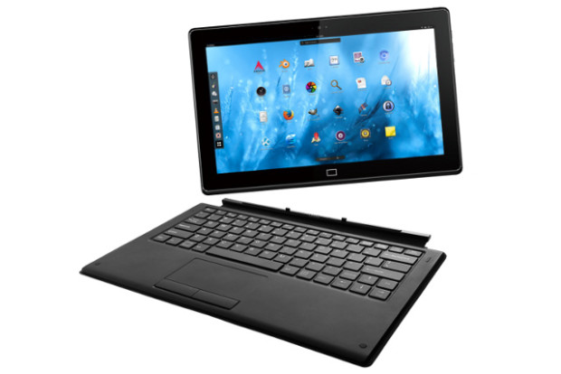

<!-- 
.. title: 4 months of work turned into GNOME, Debian testing based tablet
.. slug: 4-months-of-work-turned-into-gnome-debian-testing-based-tablet
.. date: 2016-05-20 15:47:54 UTC+02:00
.. tags: purism, debian, tablet, floss
.. category: 
.. link: 
.. description: 
.. type: text
-->

Huh, where do I start. I started working for a great CEO and great company known as [Purism](https://puri.sm). What is so great about it? First of all, CEO (Todd Weaver), is incredible passionate about Free software. Yes, you read it correctly. Free software. Not Open Source definition, but Free software definition. I want to repeat this like a mantra. In Purism we try to integrate high-end hardware with Free software. Not only that, we want our hardware to be Free as much as possible. No, we want to make it entirely Free but at the moment we don't achieve that. So instead going the way of using older hardware (as Ministry of Freedom does, and kudos to them for making such option available), we sacrifice this bit for the momentum we hope to gain - that brings growth and growth brings us much better position when we sit at negotiation table with hardware producers. If negotiations even fail, with growth we will have enough chances to heavily invest in things such as openRISC or freeing cellular modules. We want to provide in future entirely Free hardware&software device that has integrated security and privacy focus while it is easy to use and convenient as any other mainstream OS. And we choose to currently sacrifice few things to stay in loop.

Surely that can't be the only thing - and it isn't. Our current hardware runs entirely on Free software. You can install Debian main on it and all will work out of box. I know I did this and enjoy my Debian more than ever. We also have margin share program where part of profit we donate to Free software projects. We are also discussing a lot of new business model where our community will get a lot of influence (stay tuned for this). Besides all this, our OS (called PureOS - yes, a bit misfortune that we took the name of dormant distribution), was Trisquel based but now it is Debian testing based. Current PureOS 2.0 is coming with default DE as Cinnamom but we are already baking PureOS 3.0 which is going to come with GNOME Shell as default.

Why is this important? Well, around 12 hours ago we launched a [tablet campaign on Indiegogo](https://www.indiegogo.com/projects/librem-11-a-2-in-1-to-protect-your-digital-life#/) which comes with GNOME Shell and PureOS as default. Not one, but two tablets actually (although we heavily focus on 11" one). This is the product of mine 4 months dedicated work at Purism. I must give kudos to all Purism members that pushed their parts in preparation for this campaign. It was hell of a ride.

I have also approached (of course!) Debian for creation of OEM installations ISOs for our Librem products. This way, with every sold Librem that ships with Debian preinstalled, Debian will get donation. It is our way to show gratitude to Debian for all the work our community does (yes, I am still extremely proud Debian dude and I will stay like that!). Oh yes, I am the chief technology person at Purism, and besides all goals we have, I also plan (dream) about Purism being the company that has highest number of Debian Developers. In that terms I am very proud to say that Matthias Klumpp became part of Purism. Hopefully we soon extend the number of Debian population in Purism.

Of course, I think it is fairly known that I am easy to approach so if anyone has any questions (as I didn't want this post to be too long) feel free to contact me. Also - in Free software spirit - we welcome any community engagement, suggestion and/or feedback.
