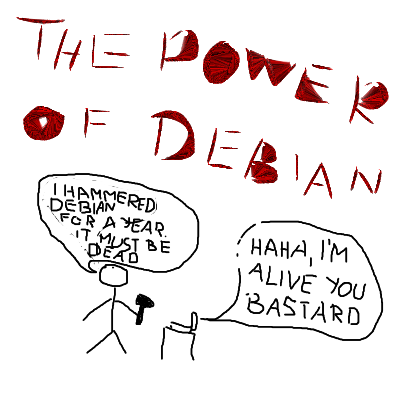

<!-- 
.. title: Random bits
.. slug: random-bits
.. date: 2015-03-26 21:18:03 UTC+02:00
.. tags: bits, debian, floss
.. link: 
.. description: 
.. type: text
-->

#### Gogs

I installed today [Gogs](https://github.com/gogits/gogs) and configured it
with mysql (yes, yes, I know - use postgres you punk!). I will not post
details of how I did it because:

  * It still has "weird" coding as pointed already by others
  * It doesn't have fork and pull request ability yet

And there was end of journey. When they code in fork/PR , I will close my eyes
on other coding stuff and try it again because Gitlab is not close to my heart
and installing their binary takes ~850MB of space which means a lot of ruby
code that could go wrong way.

<!-- TEASER_END -->

It would be really awesome to have in archive something to apt install and
have github-like place. It would be great if Debian infrastructure would have
the possibility to have that.

#### Diaspora*

Although I am thrilled about it finally reaching Debian archive, it still
isn't ready. Not even closely. I couldn't even finish installation of it and
it's not suitable for main archive as it takes files from github repo of
diaspora. Maybe poking around Bitnami folks about how they [did
it](https://bitnami.com/stack/diaspora).

#### The power of Free software

[Text Secure](https://github.com/WhisperSystems/TextSecure/) <del>is</del> was
an mobile app that I thought it could take on Viber or WhatsUp. Besides all
its goodies it had chance to send encrypted SMS to other TS users. Not
anymore. Fortunate, there is a fork called
[SMSSecure](https://github.com/SMSSecure/SMSSecure) which still has that
ability.

#### Trolls

So there is this Allwinner company that does crap after crap. Their
[latest](https://groups.google.com/forum/#!topic/linux-sunxi/g0ZS-gO3dQ8) will
reach wider audience and I hope it gets resolved in a matter how they would
react if some big proprietary company was stealing their code. It seems
Allwinner is a pseudo for Alllooser. Whoa, that was fun!

#### A year old experiment

So I had a bet with a friend that I will run for a year Debian Unstable mixed
with some packages from experimental and do some random testings on packages
of interest to them. Also I promised to update aggressively so it was to be
twice a day. This was my only machine so the bet was really good as it by
theory could break very often. Well on behalf of Debian community, I can say
that Debian hasn't had a single big breakage. Yay!

The good side: on average I had ~3000 packages installed (they were in range
from 2500-3500). I had for example xmonad, e17, gnome, cinnamon, xfce, systemd
from experimental, kernels from experimental, nginx, apache, a lot of heavy
packages, mixed packages from pip, npm, gems etc. So that makes it even more
incredible that it stayed stable. There is no bigger kudos to people working
on Debian, then when some sadist tries countless of ways to break it and
Debian is just keeps running. I mean, I was doing my $PAID_WORK on this
machine!

The bad side: there were small breakages. It's seems that polkit and systemd-
side of gnome were going through a lot of changes because sometimes system
would ask password for every action (logout, suspend, poweroff, connect to
network etc), audio would work and would not work, would often by itself just
mute sound on every play or it would take it to 100% (which would blow my head
when I had earplugs), bluetooth is almost de facto not working in gnome (my
bluetooth mice worked without single problem in lenny, squeeze, in wheezy it
maybe had once or twice a problem, but in this year long test it's almost
useless). System would also have random hangs from time to time.

The test: in the beginning my radeon card was too new and it was not supported
by FLOSS driver so I ended up using fglrx which caused me a lot of annoyance
(no brightness control, flickering of screen) but once FLOSS driver got
support I was on it, and it performed more fluid (no glitches while moving
windows). So as my friends knew that I have radeon and they want to play games
on their machines (I play my Steam games on FLOSS driver) they set me the task
to try fglrx driver every now end then. End result - there is no stable fglrx
driver for almost a year, it breaks graphical interface so I didn't even log
into DE with it for at least 8 months if not more. On the good side my
expeditions in flgrx where quick - install it, boot into disaster, remove it,
boot into freedom. Downside seems to be that removing fglrx driver, leaves a
lot of its own crap on system (I may be mistaking but it seems I am not).

